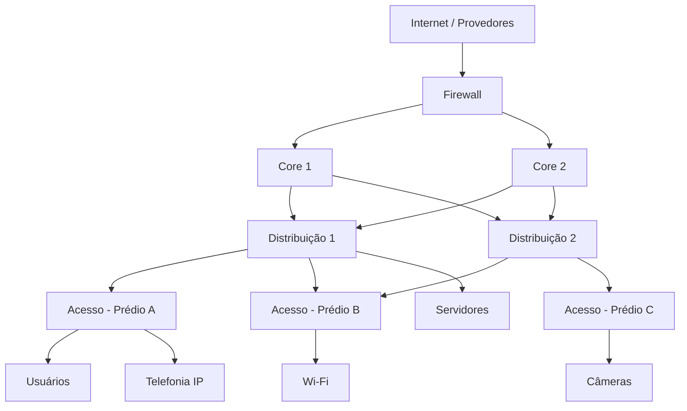

## Fundamentos de Equipamentos, Arquitetura Hierárquica e Segurança de Redes

---

## 1. Objetivos do treinamento

Ao final deste treinamento, a equipe deverá ser capaz de:

- Identificar os principais tipos de equipamentos de rede.
- Diferenciar dispositivos das camadas L1, L2, L3 e L7.
- Compreender o modelo hierárquico de redes.
- Explicar o funcionamento básico de um switch.
- Entender como a tabela MAC é aprendida e utilizada.
- Explicar o funcionamento básico de um router.
- Entender como a tabela ARP é populada.
- Compreender o fluxo de análise de um firewall.
- Diferenciar filtragem por endereço, protocolo, porta e aplicação.
- Relacionar os conceitos com situações práticas de operação e troubleshooting.

---

# 2. Modelo de camadas

Os equipamentos de rede podem ser associados às camadas do modelo OSI.

| Camada | Nome | Função principal | Exemplos |
|---|---|---|---|
| L1 | Física | Transmitir bits pelo meio físico | Cabos, fibras, hubs, repetidores |
| L2 | Enlace | Encaminhar quadros usando endereços MAC | Switches, bridges |
| L3 | Rede | Encaminhar pacotes entre redes usando IP | Routers, switches L3 |
| L4 | Transporte | Controlar portas e sessões de transporte | TCP, UDP |
| L7 | Aplicação | Interpretar protocolos e aplicações | Firewalls de aplicação, proxies, WAFs |

> Observação: alguns equipamentos executam funções de várias camadas simultaneamente. Um firewall moderno, por exemplo, pode analisar informações das camadas L3, L4 e L7.

---

# 3. Tipos de equipamento

## 3.1 Hub — Equipamento L1

O hub é um dispositivo da **camada física**.

### Principais características

- Não interpreta endereços MAC.
- Não interpreta endereços IP.
- Recebe os bits em uma porta e repete o sinal para as demais portas.
- Todos os dispositivos compartilham o mesmo domínio de colisão.
- Pode operar em half-duplex.
- Não realiza filtragem de tráfego.

### Funcionamento

Quando um dispositivo envia dados para o hub:

1. O hub recebe o sinal elétrico ou óptico.
2. Regenera o sinal, quando necessário.
3. Replica o sinal para todas as outras portas.
4. Cada dispositivo decide se deve aceitar ou descartar o quadro.

### Exemplo

Se o computador A envia dados para o computador B, o hub também encaminha o sinal para os computadores C, D e E.

Somente o computador B deverá processar o quadro, enquanto os demais deverão descartá-lo.

### Limitações

- Gera tráfego desnecessário.
- Possui maior risco de colisões.
- Não oferece segmentação.
- Não possui segurança ou inteligência de encaminhamento.
- Atualmente foi praticamente substituído por switches.

### Resumo

> O hub não sabe para quem os dados estão sendo enviados. Ele simplesmente repete o sinal para todas as portas.


---

## 3.2 Switch — Equipamento L2

O switch tradicional opera principalmente na **camada 2**.

### Principais características

- Utiliza endereços MAC.
- Aprende quais dispositivos estão conectados a cada porta.
- Encaminha quadros somente para a porta de destino conhecida.
- Cada porta normalmente representa um domínio de colisão independente.
- Pode operar em full-duplex.
- Reduz significativamente as colisões em comparação com um hub.
- Pode suportar VLANs, STP, agregação de links e funções.

### Funções comuns de um switch

- Encaminhamento de quadros.
- Aprendizado de endereços MAC.
- Criação de VLANs.
- Controle de broadcast.
- Spanning Tree Protocol — STP.
- Link Aggregation.
- Port Security.
- QoS.
- Alimentação via PoE, em modelos compatíveis.


---

## 3.3 Router — Equipamento L3

O router, ou roteador, opera principalmente na **camada 3**.

### Principais características

- Utiliza endereços IP.
- Interliga redes ou sub-redes diferentes.
- Analisa a tabela de roteamento.
- Escolhe o melhor caminho para encaminhar pacotes.
- Normalmente separa domínios de broadcast.
- Pode executar NAT, DHCP, VPN, QoS e outras funções.

### Exemplos de uso

- Interligar a rede interna à Internet.
- Interligar matriz e filiais.
- Interligar VLANs diferentes.
- Encaminhar tráfego por múltiplos links.
- Utilizar protocolos de roteamento dinâmico, como OSPF ou BGP.

### Exemplo

Um router pode interligar:

- Rede de usuários: `192.168.10.0/24`
- Rede de servidores: `192.168.20.0/24`
- Rede de telefonia IP: `192.168.30.0/24`
- Link com o provedor: `200.100.50.0/30`


---

## 3.4 Firewall — Equipamento L7

O firewall é responsável por controlar o tráfego com base em políticas de segurança.

Dependendo da tecnologia, ele pode analisar:

- Endereço IP de origem.
- Endereço IP de destino.
- Protocolo.
- Porta de origem.
- Porta de destino.
- Estado da conexão.
- Usuário ou identidade.
- URL.
- Aplicação.
- Conteúdo da sessão.
- Assinaturas de ameaças.
- Categoria de navegação.

### Tipos de firewall

#### Firewall tradicional ou packet filtering

Analisa principalmente:

- IP de origem.
- IP de destino.
- Protocolo.
- Porta.
- Interface ou zona.

#### Stateful firewall

Além dos campos básicos, mantém o estado das conexões.

Exemplo:

- Um cliente interno inicia uma conexão para um servidor externo.
- O firewall registra essa sessão.
- A resposta do servidor é permitida porque pertence a uma conexão já estabelecida.

#### Next-Generation Firewall — NGFW

Pode realizar:

- Inspeção profunda de pacotes.
- Identificação de aplicações.
- Controle por usuário.
- Prevenção contra intrusão.
- Antivírus de rede.
- Filtragem web.
- Inspeção de tráfego criptografado, quando configurado.
- Controle de aplicações.

> Importante: firewall não é sinônimo de antivírus. O firewall controla comunicações conforme políticas. Outras funções podem complementar essa proteção.


---

# 4. Projeto hierárquico de redes

O modelo hierárquico organiza a rede em três camadas principais:

1. Acesso.
2. Distribuição.
3. Core.

Esse modelo facilita:

- Escalabilidade.
- Administração.
- Redundância.
- Troubleshooting.
- Aplicação de políticas.
- Expansão da infraestrutura.

---

## 4.1 Camada de Acesso

A camada de acesso é o ponto de conexão dos dispositivos finais.

### Dispositivos normalmente conectados

- Computadores.
- Telefones IP.
- Impressoras.
- Câmeras.
- Access points.
- IoT.
- Equipamentos industriais.
- Dispositivos de automação.

### Funções principais

- Conectar usuários e dispositivos.
- Aplicar VLANs.
- Aplicar autenticação de porta.
- Fornecer PoE.
- Aplicar segurança de acesso.
- Controlar portas físicas.
- Classificar e priorizar tráfego.

### Tecnologias comuns

- VLAN.
- 802.1X.
- Port Security.
- DHCP Snooping.
- Dynamic ARP Inspection.
- BPDU Guard.
- Storm Control.
- QoS.
- PoE.

### Exemplo

Um switch de acesso pode possuir:

- Portas para computadores.
- Portas para telefones IP.
- Portas para câmeras.
- Uplinks redundantes para a distribuição.

---

## 4.2 Camada de Distribuição

A camada de distribuição funciona como ponto de agregação da camada de acesso.

### Funções principais

- Interligar switches de acesso.
- Realizar roteamento entre VLANs.
- Aplicar políticas de segurança.
- Aplicar filtros e listas de controle.
- Resumir rotas.
- Fornecer redundância.
- Controlar o tráfego entre segmentos.

### Recursos comuns

- Routing entre VLANs.
- ACLs.
- HSRP, VRRP ou protocolos semelhantes.
- Redundância de links.
- Agregação de links.
- QoS.
- Roteamento estático ou dinâmico.

### Exemplo

A distribuição pode interligar:

- VLAN de usuários.
- VLAN de voz.
- VLAN de servidores.
- VLAN de convidados.
- VLAN de gerenciamento.

---

## 4.3 Camada de Core

O core é o núcleo da rede.

### Funções principais

- Transportar grandes volumes de tráfego.
- Interligar blocos de distribuição.
- Oferecer baixa latência.
- Garantir alta disponibilidade.
- Evitar processamento desnecessário.
- Operar com links de alta velocidade.

### Características desejáveis

- Alta capacidade de encaminhamento.
- Redundância de equipamentos.
- Redundância de fontes de energia.
- Redundância de links.
- Baixa latência.
- Convergência rápida.
- Gerenciamento centralizado.
- Monitoramento constante.

### Princípio de funcionamento

> O core deve ser rápido, resiliente e simples. Políticas complexas normalmente devem ser aplicadas nas camadas de distribuição, segurança ou acesso, evitando sobrecarga no núcleo.

---

## 4.4 Diagrama do modelo hierárquico



---

# 5. Como um switch funciona

## 5.1 Conceitos fundamentais

O switch trabalha com **quadros Ethernet**.

Um quadro Ethernet normalmente contém:

- MAC de destino.
- MAC de origem.
- Tipo ou tamanho.
- Dados.
- FCS — verificação de integridade.

Exemplo simplificado:

```text
+----------------+----------------+----------+-------+-----+
| MAC Destino    | MAC Origem     | Tipo     | Dados | FCS |
+----------------+----------------+----------+-------+-----+
```

---

## 5.2 Tabela MAC

A tabela MAC relaciona:

```text
Endereço MAC -> Porta do switch -> VLAN
```

Exemplo:

| Endereço MAC | Porta | VLAN | Tipo |
|---|---|---:|---|
| 00:11:22:33:44:55 | Gi0/1 | 10 | Dinâmico |
| 00:AA:BB:CC:DD:EE | Gi0/2 | 10 | Dinâmico |
| 00:10:20:30:40:50 | Gi0/24 | 20 | Dinâmico |

A tabela permite que o switch saiba por qual porta deve encaminhar um quadro.


---

## 5.3 Como a tabela MAC é populada

O switch aprende o endereço MAC a partir do **MAC de origem** dos quadros recebidos.

### Processo de aprendizado

1. O switch recebe um quadro pela porta 1.
2. Analisa o MAC de origem.
3. Registra o MAC de origem associado à porta 1.
4. Registra também a VLAN correspondente.
5. Atualiza ou renova o tempo de validade da entrada.

Exemplo:

```text
Quadro recebido na porta Gi0/1
MAC de origem: 00:11:22:33:44:55
VLAN: 10

Registro aprendido:

00:11:22:33:44:55 -> Gi0/1 -> VLAN 10
```

> O switch aprende a localização pelo endereço MAC de origem, e não pelo endereço MAC de destino.

---

## 5.4 Encaminhamento de quadros

Depois de aprender os endereços, o switch analisa o MAC de destino.

### Caso 1 — MAC de destino conhecido

Se o MAC de destino estiver na tabela:

1. O switch consulta a tabela MAC.
2. Identifica a porta de destino.
3. Encaminha o quadro somente por essa porta.
4. Não envia o quadro para as demais portas da mesma VLAN.

### Caso 2 — MAC de destino desconhecido

Se o MAC de destino não estiver na tabela:

1. O switch trata o quadro como unicast desconhecido.
2. Replica o quadro para as portas da mesma VLAN.
3. Não envia o quadro de volta pela porta de origem.
4. Quando o dispositivo de destino responder, o switch aprenderá seu MAC.

### Caso 3 — Broadcast

Quadros broadcast são encaminhados para todas as portas da mesma VLAN, exceto a porta de origem.

Exemplo de endereço broadcast:

```text
FF:FF:FF:FF:FF:FF
```

### Caso 4 — Multicast

O tratamento depende da configuração do switch.

Pode ocorrer:

- Inundação semelhante ao broadcast.
- Controle por IGMP Snooping.
- Encaminhamento apenas para portas interessadas.

---

## 5.5 Expiração da tabela MAC

As entradas dinâmicas da tabela MAC possuem um tempo de validade.

Se o switch não receber novos quadros daquele endereço durante o período configurado:

1. A entrada expira.
2. O endereço é removido da tabela.
3. O switch terá que aprendê-lo novamente quando receber outro quadro.

Esse mecanismo permite que o switch acompanhe mudanças de porta.

---

## 5.6 Mudança de porta

Se o mesmo endereço MAC aparecer em outra porta:

1. O switch identifica o novo local.
2. Atualiza a tabela MAC.
3. O endereço passa a ser associado à nova porta.

Exemplo:

```text
Antes:
00:11:22:33:44:55 -> Gi0/1

Depois:
00:11:22:33:44:55 -> Gi0/5
```

Esse comportamento é normal quando um dispositivo é movido de uma porta para outra.

Entretanto, mudanças frequentes podem indicar:

- Loop de camada 2.
- Usuário conectando um switch não autorizado.
- Problema de cabeamento.
- Ataque de MAC flooding.
- Configuração incorreta.

---

## 5.7 VLANs e tabela MAC

A tabela MAC deve ser analisada junto com a VLAN.

O mesmo endereço MAC não deveria aparecer simultaneamente em locais incompatíveis. Além disso, o switch não encaminha normalmente um quadro entre VLANs diferentes.

Exemplo:

```text
MAC A -> Gi0/1 -> VLAN 10
MAC B -> Gi0/2 -> VLAN 20
```

Para que um dispositivo na VLAN 10 se comunique com outro na VLAN 20, é necessário um equipamento ou interface de camada 3.

---

## 5.8 Exemplo de comunicação através de um switch

Considere:

- Computador A: MAC `AA-AA-AA-AA-AA-AA`
- Computador B: MAC `BB-BB-BB-BB-BB-BB`
- A está na porta Gi0/1.
- B está na porta Gi0/2.

### Primeira comunicação

1. A envia um quadro para B.
2. O switch aprende:

```text
AA-AA-AA-AA-AA-AA -> Gi0/1
```

3. O switch ainda não conhece B.
4. O switch inunda o quadro na VLAN.
5. B responde.
6. O switch aprende:

```text
BB-BB-BB-BB-BB-BB -> Gi0/2
```

### Próximas comunicações

1. A envia um quadro para B.
2. O switch consulta a tabela MAC.
3. Identifica que B está na Gi0/2.
4. Encaminha o quadro somente para Gi02.

---

# 6. Como funciona um router

## 6.1 Função principal

O router encaminha pacotes entre redes diferentes.

Ele toma decisões usando principalmente:

- Endereço IP de destino.
- Tabela de roteamento.
- Interface de saída.
- Próximo salto.
- Métrica da rota.
- Estado das interfaces.

---

## 6.2 Pacote IP

Um pacote IP contém, entre outras informações:

- IP de origem.
- IP de destino.
- TTL.
- Protocolo da camada de transporte.
- Dados.

Exemplo:

```text
IP de origem: 192.168.10.25
IP de destino: 192.168.20.50
Protocolo: TCP
```

---

## 6.3 Tabela de roteamento

A tabela de roteamento relaciona redes de destino a caminhos possíveis.

Exemplo:

| Rede de destino | Próximo salto | Interface | Origem |
|---|---|---|---|
| 192.168.10.0/24 | Diretamente conectada | G0/0 | Connected |
| 192.168.20.0/24 | Diretamente conectada | G0/1 | Connected |
| 10.0.0.0/8 | 192.168.20.1 | G0/1 | OSPF |
| 0.0.0.0/0 | 200.100.50.1 | G0/2 | Estática |

A rota `0.0.0.0/0` é conhecida como rota padrão.

---

## 6.4 Processo de encaminhamento

Quando um router recebe um pacote, normalmente executa as seguintes etapas:

1. Recebe o quadro pela interface.
2. Verifica a integridade do quadro.
3. Remove o cabeçalho Ethernet recebido.
4. Analisa o endereço IP de destino.
5. Consulta a tabela de roteamento.
6. Seleciona a rota mais específica.
7. Determina a interface de saída e o próximo salto.
8. Consulta a tabela ARP, quando necessário.
9. Cria um novo quadro de camada 2.
10. Encaminha o pacote pela interface de saída.
11. Reduz o valor do TTL.
12. Recalcula informações necessárias do cabeçalho IP.

> O endereço MAC é alterado a cada salto de camada 2. Os endereços IP de origem e destino normalmente permanecem os mesmos durante o roteamento, exceto quando há NAT.

---

## 6.5 Escolha da rota mais específica

O router utiliza o princípio do **longest prefix match**, ou correspondência pelo prefixo mais longo.

Exemplo de rotas:

```text
10.0.0.0/8
10.10.0.0/16
10.10.20.0/24
```

Para o destino `10.10.20.15`, a rota escolhida será:

```text
10.10.20.0/24
```

Ela é a rota mais específica para esse endereço.

---

## 6.6 Quando não existe rota

Se o router não encontrar uma rota para o destino:

- Pode usar uma rota padrão, se existir.
- Pode descartar o pacote.
- Pode enviar uma mensagem ICMP de destino inalcançável.

---

# 7. Tabela ARP

## 7.1 O que é ARP

ARP significa **Address Resolution Protocol**.

Ele relaciona:

```text
Endereço IPv4 -> Endereço MAC
```

Exemplo:

| Endereço IP | Endereço MAC | Interface | Estado |
|---|---|---|---|
| 192.168.10.25 | AA:AA:AA:AA:AA:AA | G0/0 | Dinâmico |
| 192.168.10.30 | BB:BB:BB:BB:BB:BB | G0/0 | Dinâmico |

O ARP é utilizado para descobrir o endereço MAC associado a um endereço IPv4 na rede local.

---

## 7.2 Quando o ARP é necessário

Um dispositivo precisa utilizar ARP quando:

- Deseja enviar um pacote IPv4 para outro dispositivo da mesma rede local.
- Precisa enviar um pacote ao gateway padrão.
- Não conhece o MAC correspondente ao próximo salto.

### Comunicação na mesma rede

Exemplo:

```text
Origem: 192.168.10.25
Destino: 192.168.10.30
```

Como os dois endereços pertencem à mesma sub-rede, o dispositivo de origem precisa descobrir o MAC de `192.168.10.30`.

### Comunicação com outra rede

Exemplo:

```text
Origem: 192.168.10.25
Destino: 192.168.20.30
```

O destino está em outra rede. Nesse caso, o dispositivo de origem não procura o MAC do servidor remoto.

Ele procura o MAC do gateway, por exemplo:

```text
192.168.10.1 -> MAC do router
```

O router será responsável por encaminhar o pacote.

---

## 7.3 Como a tabela ARP é populada

### Processo de resolução

1. O dispositivo verifica sua tabela ARP.
2. Se já possuir uma entrada válida, usa o MAC armazenado.
3. Se não possuir, envia uma requisição ARP em broadcast.
4. O dispositivo que possui o IP consultado responde em unicast.
5. A origem registra a associação IP-MAC.
6. O pacote pode ser encapsulado e enviado.

### Exemplo

A estação deseja descobrir o MAC de `192.168.10.30`.

#### Requisição ARP

```text
Quem possui 192.168.10.30?
Informe para 192.168.10.25.
```

Essa mensagem é enviada como broadcast Ethernet:

```text
FF:FF:FF:FF:FF:FF
```

#### Resposta ARP

```text
192.168.10.30 está associado ao MAC BB:BB:BB:BB:BB:BB.
```

A tabela passa a conter:

```text
192.168.10.30 -> BB:BB:BB:BB:BB:BB
```

---

## 7.4 Tipos de entradas ARP

### Entrada dinâmica

- Aprendida automaticamente.
- Possui tempo de expiração.
- Pode desaparecer após um período sem uso.

### Entrada estática

- Configurada manualmente.
- Não depende do aprendizado automático.
- Pode ser utilizada em situações específicas de segurança ou infraestrutura.

### Entrada incompleta

Indica que o dispositivo enviou uma requisição ARP, mas ainda não recebeu resposta.

Pode ocorrer devido a:

- Dispositivo desligado.
- Problema de VLAN.
- Falha de conectividade.
- Endereço IP incorreto.
- Firewall bloqueando ARP de forma inadequada.
- Problemas físicos.

---

## 7.5 Cache ARP

A tabela ARP também é chamada de cache ARP.

O cache evita que o dispositivo precise realizar uma nova requisição para cada pacote enviado.

Quando uma entrada expira:

1. O dispositivo remove ou marca a entrada como inválida.
2. Na próxima comunicação, realiza uma nova resolução ARP.
3. Atualiza o cache com a resposta recebida.

---

## 7.6 Riscos relacionados ao ARP

O ARP não possui autenticação nativa forte.

Por isso, pode ser alvo de:

- ARP Spoofing.
- ARP Poisoning.
- Interceptação de tráfego.
- Ataques de Man-in-the-Middle.

Mecanismos de proteção incluem:

- Dynamic ARP Inspection.
- DHCP Snooping.
- Entradas ARP estáticas, quando aplicável.
- Segmentação por VLAN.
- Monitoramento de alterações de MAC e ARP.
- Uso de protocolos seguros, como HTTPS, SSH e VPN.

---

# 8. Como funciona um firewall

## 8.1 Objetivo

O firewall controla o tráfego entre redes ou zonas de segurança com base em regras definidas por uma política.

Exemplos de zonas:

- Internet.
- DMZ.
- Rede interna.
- Rede de servidores.
- Rede de convidados.
- Rede de gerenciamento.
- Rede de voz.

---

## 8.2 Elementos de uma regra de firewall

Uma regra pode conter:

- Interface ou zona de origem.
- Interface ou zona de destino.
- Endereço IP de origem.
- Endereço IP de destino.
- Serviço ou porta.
- Protocolo.
- Usuário.
- Aplicação.
- Horário.
- Ação.
- Registro de eventos.
- Inspeções adicionais.

Exemplo:

| Origem | Destino | Serviço | Ação |
|---|---|---|---|
| Rede interna | Internet | HTTP/HTTPS | Permitir |
| Internet | Servidores internos | Qualquer | Negar |
| Internet | DMZ | HTTPS | Permitir |
| Rede de convidados | Rede interna | Qualquer | Negar |

---

## 8.3 Ações possíveis

As ações mais comuns são:

- Allow — permitir.
- Deny — negar silenciosamente.
- Reject — rejeitar informando ao originador.
- Drop — descartar.
- Log — registrar o evento.
- NAT — traduzir endereços.
- Inspect — inspecionar o conteúdo ou o estado da sessão.

---

# 9. Fluxo de processamento do firewall

## 9.1 Fluxo geral

Quando um pacote chega ao firewall, o processamento pode envolver:

1. Recebimento do pacote.
2. Identificação da interface de entrada.
3. Identificação da zona de origem.
4. Verificação da sessão existente.
5. Decisão de roteamento.
6. Identificação da zona de destino.
7. Aplicação de NAT, quando configurado.
8. Consulta às regras de segurança.
9. Inspeção de protocolo e aplicação.
10. Aplicação de perfis de segurança.
11. Registro dos eventos.
12. Encaminhamento ou descarte.

> A ordem exata varia conforme o fabricante e a plataforma. O fluxo abaixo representa uma visão conceitual.

---

## 9.2 Verificação de sessão

Em um firewall stateful, a primeira verificação normalmente considera se o pacote pertence a uma sessão conhecida.

### Pacote pertencente a uma sessão válida

Se o pacote pertence a uma conexão permitida e estabelecida:

- O firewall pode encaminhá-lo utilizando as informações da sessão.
- A análise pode ser mais rápida.
- O tráfego de retorno pode ser permitido automaticamente, de acordo com a política.

### Nova sessão

Se o pacote inicia uma nova conexão:

- O firewall precisa identificar origem, destino, serviço e contexto.
- Em seguida, compara o tráfego com as regras configuradas.

---

# 10. Processamento Top-Down

## 10.1 Conceito

O processamento **top-down** significa que as regras são avaliadas de cima para baixo, começando pela primeira regra da política.

Exemplo:

| Ordem | Origem | Destino | Serviço | Ação |
|---:|---|---|---|---|
| 1 | Qualquer | Servidor web | HTTPS | Permitir |
| 2 | Rede interna | Internet | HTTP/HTTPS | Permitir |
| 3 | Qualquer | Qualquer | Qualquer | Negar |

Um tráfego destinado ao servidor web via HTTPS será processado pela regra 1.

O firewall normalmente interrompe a busca após encontrar uma regra aplicável.

---

## 10.2 Importância da ordem das regras

A ordem é fundamental.

Considere:

| Ordem | Origem | Destino | | Ação |
|---:|---|---|---|---|
| 1 | Qualquer | Qualquer | Qualquer | Permitir |
| 2 | Internet | Servidor interno | Qualquer | Negar |

A regra 1 permite todo o tráfego. Portanto, a regra 2 nunca será alcançada.

### Regra geral

> Regras específicas devem aparecer antes de regras genéricas.

---

## 10.3 Exemplo correto

| Ordem | Origem | Destino | Serviço | Ação |
|---:|---|---|---|---|
| 1 | Internet | Servidor DMZ | HTTPS | Permitir |
| 2 | Internet | Servidor DMZ | HTTP | Redirecionar ou permitir conforme necessidade |
| 3 | Internet | Rede interna | Qualquer | Negar |
| 4 | Rede interna | Internet | HTTP/HTTPS | Permitir |
| 5 | Qualquer | Qualquer | Qualquer | Negar e registrar |

---

## 10.4 Regra implícita de negação

Muitos firewalls possuem uma regra implícita ao final da política:

```text
Deny all
```

Ou seja, se nenhum tráfego corresponder às regras anteriores, ele será negado.

Mesmo assim, é recomendável configurar uma regra explícita de negação final para:

- Registrar eventos.
- Facilitar auditoria.
- Auxiliar no troubleshooting.
- Identificar tráfego não previsto.

---

# 11. Firewall e NAT

## 11.1 O que é NAT

NAT significa **Network Address Translation**.

Ele altera endereços IP e, em alguns casos, portas durante o encaminhamento.

### Exemplo

Rede interna:

```text
192.168.10.25
```

Endereço público do firewall:

```text
200.100.50.10
```

Ao acessar a Internet, o firewall pode traduzir:

```text
192.168.10.25:52000
```

para:

```text
200.100.50.10:52000
```

---

## 11.2 Tipos comuns de NAT

- Source NAT — altera o endereço de origem.
- Destination NAT — altera o endereço de destino.
- Port Address Translation — utiliza portas para compartilhar um endereço público.
- Static NAT — associação fixa entre endereços.
- Port Forwarding — encaminhamento de uma porta pública para um serviço interno.

---

# 12. Exemplo completo de fluxo

Considere o seguinte cenário:

- Cliente interno: `192.168.10.25`
- Gateway: `192.168.10.1`
- Firewall: saída para a Internet
- Servidor web externo: `203.0.113.50`
- Serviço: HTTPS, porta TCP 443

## Etapas

1. O cliente identifica que `203.0.113.50` está fora de sua rede local.
2. O cliente consulta a tabela ARP para descobrir o MAC do gateway.
3. O cliente envia o quadro para o MAC do gateway.
4. O router ou firewall recebe o quadro.
5. O equipamento consulta a tabela de roteamento.
6. O firewall verifica se existe uma sessão relacionada.
7. Como é uma nova sessão, consulta as regras de segurança.
8. A regra permite tráfego HTTPS da rede interna para a Internet.
9. O firewall realiza Source NAT.
10. O firewall encaminha o pacote ao provedor.
11. A resposta retorna ao endereço público traduzido.
12. O firewall encontra a sessão correspondente.
13. O firewall desfaz a tradução NAT.
14. O pacote é encaminhado ao cliente interno.
15. O cliente recebe a resposta.

---

# 13. Comparação entre os equipamentos

| Equipamento | Camada principal | Unidade analisada | Usa MAC? | Usa IP? | Função principal |
|---|---:|---|---|---|---|
| Hub | L1 | Bits | Não | Não | Repetir sinal |
| Switch | L2 | Quadros | Sim | Normalmente não para encaminhamento | Encaminhar dentro da rede local |
| Router | L3 | Pacotes | Sim, para entrega local | Sim | Interligar redes |
| Firewall | L3 a L7 | Pacotes, sessões e aplicações | Sim | Sim | Controlar e proteger o tráfego |

---

# 14. Troubleshooting básico

## 14.1 Problemas relacionados ao hub ou camada física

Verificar:

- Alimentação.
- Cabos.
- Conectores.
- Fibra óptica.
- LEDs das interfaces.
- Velocidade e duplex.
- Perda de sinal.
- Interferência.
- Distância máxima do meio.

---

## 14.2 Problemas relacionados ao switch

Verificar:

- Porta correta.
- VLAN configurada.
- Estado da porta.
- Tabela MAC.
- Erros e descartes.
- Loops de camada 2.
- STP.
- Duplex e velocidade.
- Port Security.
- Broadcast excessivo.
- MAC flapping.

### Perguntas úteis

- O MAC do dispositivo foi aprendido?
- Em qual porta e VLAN ele foi aprendido?
- A porta está ativa?
- O dispositivo está transmitindo?
- Existe alguma violação de segurança?
- Existe loop ou tempestade de broadcast?

---

## 14.3 Problemas relacionados ao router

Verificar:

- Endereço IP da interface.
- Máscara.
- Gateway.
- Estado da interface.
- Tabela de roteamento.
- Rota padrão.
- Rotas estáticas.
- Protocolos de roteamento.
- ACLs.
- MTU.
- Tabela ARP.
- TTL e mensagens ICMP.

### Perguntas úteis

- Existe rota para o destino?
- A rota mais específica está correta?
- O próximo salto está acessível?
- A interface de saída está ativa?
- O router conhece o MAC do próximo salto?

---

## 14.4 Problemas relacionados ao ARP

Verificar:

- Tabela ARP.
- Entradas incompletas.
- Respostas ARP.
- VLAN.
- Conectividade local.
- Conflitos de IP.
- ARP Spoofing.
- DHCP Snooping.
- Dynamic ARP Inspection.

### Sintomas comuns

- Dispositivo consegue acessar alguns destinos, mas não outros.
- Comunicação local intermitente.
- Entrada ARP mudando constantemente.
- Conflito de endereço IP.
- Gateway inacessível.
- Grande quantidade de requisições ARP.

---

## 14.5 Problemas relacionados ao firewall

Verificar:

- Interface de entrada.
- Interface de saída.
- Zonas de segurança.
- Regra aplicada.
- Ordem das regras.
- NAT.
- Rota de retorno.
- Estado da sessão.
- Portas liberadas.
- Logs.
- Perfis de segurança.
- Inspeção SSL/TLS.
- Resolução DNS.
- MTU e fragmentação.

### Perguntas úteis

- O tráfego chega ao firewall?
- Qual regra foi aplicada?
- A ação foi permitir ou negar?
- O NAT foi realizado?
- Existe uma rota de retorno?
- O firewall recebeu a resposta?
- A sessão está sendo criada?
- Algum perfil de segurança bloqueou o tráfego?

---

# 15. Boas práticas

## 15.1 Boas práticas de switching

- Utilizar VLANs para segmentar a rede.
- Desabilitar portas não utilizadas.
- Aplicar descrição nas interfaces.
- Utilizar Port Security quando apropriado.
- Controlar broadcasts.
- Implementar STP corretamente.
- Utilizar redundância planejada.
- Monitorar erros e descarte de pacotes.
- Evitar conexões físicas não documentadas.
- Manter a tabela de ativos atualizada.

---

## 15.2 Boas práticas de roteamento

- Documentar todas as redes.
- Evitar rotas desnecessárias.
- Utilizar sumarização quando possível.
- Monitorar os protocolos de roteamento.
- Manter rotas de retorno.
- Utilizar autenticação em protocolos de roteamento.
- Controlar anúncios de rotas.
- Planejar redundância.
- Validar MTU e caminhos assimétricos.

---

## 15.3 Boas práticas de firewall

- Adotar o princípio do menor privilégio.
- Permitir somente o tráfego necessário.
- Colocar regras específicas antes das genéricas.
- Manter uma regra final de negação com registro.
- Evitar regras excessivamente amplas.
- Revisar regras periodicamente.
- Remover regras obsoletas.
- Documentar o objetivo de cada regra.
- Separar ambientes por zonas.
- Monitorar logs e eventos.
- Controlar acessos administrativos.
- Fazer backup da configuração.
- Testar mudanças antes da implantação.
- Verificar sempre o tráfego de retorno.

---

# 16. Resumo dos principais conceitos

## Hub

- Opera na camada 1.
- Repassa sinais para todas as portas.
- Não conhece MAC nem IP.
- Está praticamente obsoleto em redes modernas.

## Switch

- Opera principalmente na camada 2.
- Aprende MAC de origem.
- Mantém uma tabela MAC.
- Encaminha quadros pela porta correta.
- Inunda quadros quando o destino é desconhecido.

## Router

- Opera na camada 3.
- Interliga redes diferentes.
- Consulta a tabela de roteamento.
- Utiliza ARP para descobrir o MAC do próximo salto.
- Escolhe a rota mais específica.

## ARP

- Relaciona IPv4 e MAC.
- Usa broadcast para fazer perguntas.
- Recebe resposta normalmente em unicast.
- Mantém um cache temporário.

## Firewall

- Controla o tráfego com base em políticas.
- Pode ser stateful e analisar aplicações.
- Avalia regras normalmente de cima para baixo.
- Regras específicas devem vir antes das genéricas.
- A negação implícita ou explícita deve existir ao final.

## Arquitetura hierárquica

- Acesso: conecta os dispositivos finais.
- Distribuição: agrega, roteia e aplica políticas.
- Core: transporta grandes volumes de tráfego com alta disponibilidade.

---

# 17. Exercícios de fixação

## Exercício 1

Um switch recebe um quadro cujo MAC de destino ainda não está na tabela MAC. O que ele faz?

### Resposta esperada

O switch encaminha o quadro para as demais portas da mesma VLAN, exceto a porta de origem. Quando o dispositivo de destino responder, o switch aprenderá seu endereço MAC.

---

## Exercício 2

Um computador deseja acessar um servidor localizado em outra rede. Qual endereço MAC ele precisa descobrir por ARP?

### Resposta esperada

O computador precisa descobrir o MAC do gateway padrão, e não o MAC do servidor remoto.

---

## Exercício 3

Por que uma regra de firewall que permite todo o tráfego no início da política pode ser perigosa?

### Resposta esperada

Porque ela será aplicada antes das regras específicas e poderá permitir tráfego que deveria ser bloqueado. As regras seguintes provavelmente não serão avaliadas.

---

## Exercício 4

Qual camada é responsável por interligar redes IP diferentes?

### Resposta esperada

A camada 3, normalmente por meio de um router ou switch Layer 3.

---

## Exercício 5

Qual é a diferença entre a tabela MAC e a tabela ARP?

### Resposta esperada

A tabela MAC relaciona endereços MAC às portas e VLANs de um switch. A tabela ARP relaciona endereços IPv4 aos respectivos endereços MAC.

---

# 18. Checklist operacional

## Antes de alterar a rede

- [ ] Entender o objetivo da mudança.
- [ ] Identificar os equipamentos envolvidos.
- [ ] Validar o impacto esperado.
- [ ] Fazer backup das configurações.
- [ ] Confirmar a janela de manutenção.
- [ ] Definir um plano de reversão.
- [ ] Comunicar as partes envolvidas.

## Durante a alteração

- [ ] Registrar os comandos executados.
- [ ] Monitorar interfaces.
- [ ] Verificar tabelas MAC e ARP.
- [ ] Validar rotas.
- [ ] Acompanhar sessões do firewall.
- [ ] Monitorar alarmes e logs.
- [ ] Testar conectividade.

## Após a alteração

- [ ] Confirmar a disponibilidade dos serviços.
- [ ] Validar o tráfego esperado.
- [ ] Confirmar as regras de firewall.
- [ ] Verificar a redundância.
- [ ] Atualizar a documentação.
- [ ] Registrar resultados e evidências.
- [ ] Encerrar ou acompanhar incidentes relacionados.

---

# Conclusão

Uma rede confiável depende da compreensão integrada de seus equipamentos e processos:

- O **hub** repete sinais.
- O **switch** encaminha quadros com base em endereços MAC.
- O **router** encaminha pacotes entre redes usando endereços IP.
- O **ARP** resolve endereços IPv4 em endereços MAC.
- O **firewall** controla o tráfego de acordo com políticas de segurança.
- O modelo **Acesso, Distribuição e Core** organiza a infraestrutura para melhorar desempenho, disponibilidade e facilidade de gerenciamento.

A operação eficiente exige não apenas conhecer cada equipamento isoladamente, mas também compreender como eles trabalham juntos durante o fluxo de comunicação.
