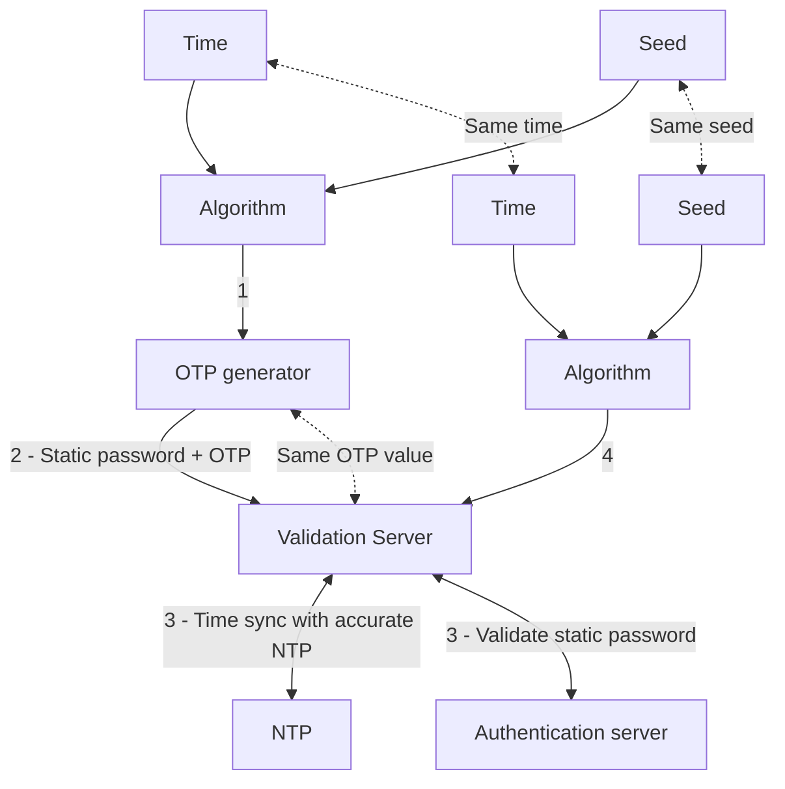

- Algo que você sabe
- Algo que você tem

- One-timwe Passwords(OTP)

```mermaid
flowchart TB
    T1["Time"] --> A1["Algorithm"]
    S1["Seed"] --> A1
    A1 -->|"1"| OTP["OTP generator"]

    OTP -->|"2 - Static password + OTP"| VS["Validation Server"]

    T2["Time"] --> A2["Algorithm"]
    S2["Seed"] --> A2
    A2 -->|"4"| VS

    VS <-->|"3 - Time sync with accurate NTP"| NTP["NTP"]
    VS <-->|"3 - Validate static password"| AUTH["Authentication server"]

    OTP <-.->|"Same OTP value"| VS
    S1 <-.->|"Same seed"| S2
    T1 <-.->|"Same time"| T2
```
