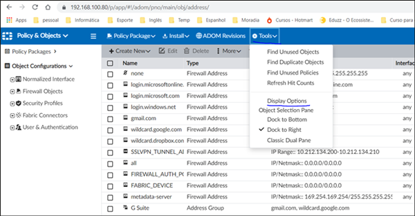
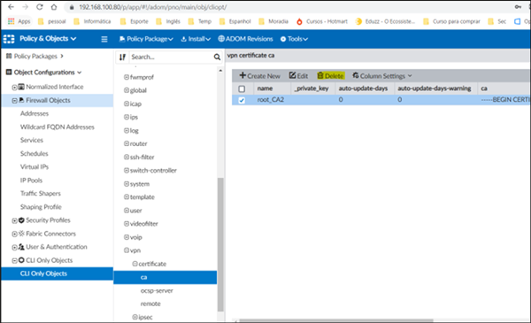

#### **Requisito mínimo**
- 8Gb
- 4 Processador

#### **Reduzir segurança para laboratório**


```bash
config system global
    set ssl-low-encryption enable
    set oftp-ssl-protocol tlsv1.0
    set enc-algorithm low
    set fgfm-ssl-protocol tlsv1.0
end
```
#### **Desativar o certificado CA**





Quando o FortiGate é zerado (factory reset), o FortiManager precisa ser atualizado com o novo serial number:

```bash
# Verificar dispositivos gerenciados
diagnose dvm device list

# Substituir o serial number antigo pelo novo
execute device replace sn <sn_novo>
```
