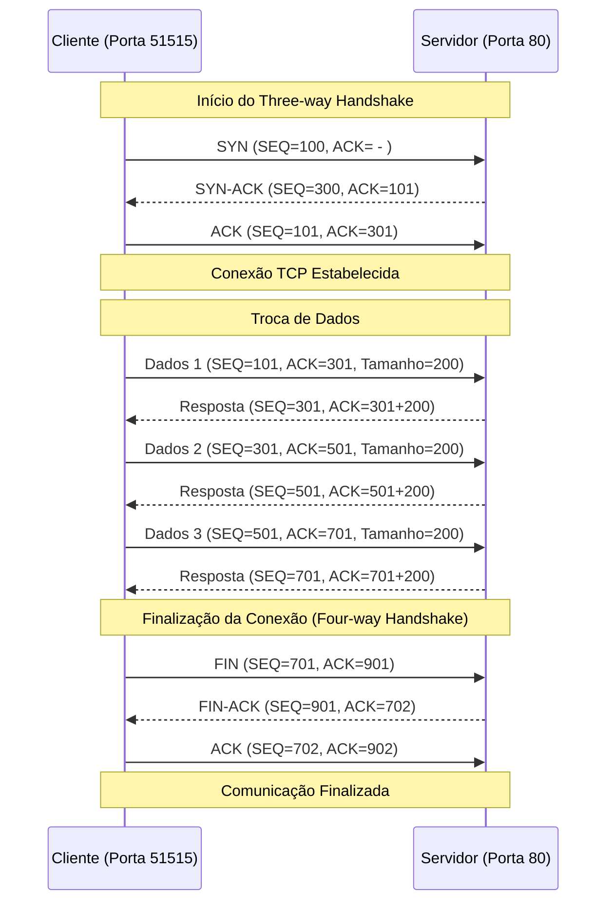

Ao se iniciar uma conexão TCP é feito um handshake, que consiste no envio de 3 pacotes (SYN, SYN/ACK e ACK).

Em toda sessão TCP os envolvidos sorteiam um ISN (Initial Sequence Number) que deve ser incrementado, um para cada pacote, durante o handshake. Esse número apoia o processo de confirmação de recebimento de pacotes.

![[image_4d3986f0-7d77-481b-951c-d3f1f34eb32820220220_192917.jpg]]

