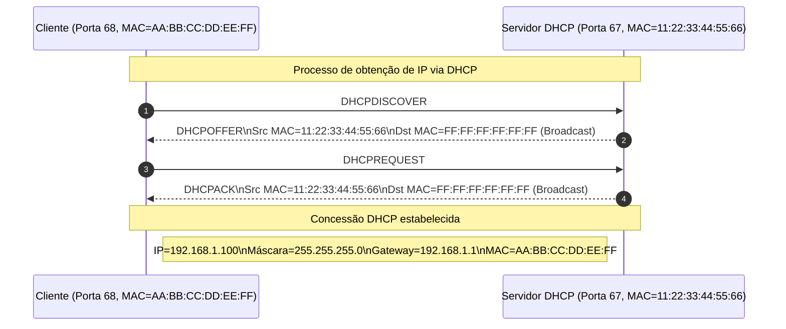

```mermaid
sequenceDiagram
    autonumber
    participant C as Cliente (Porta 68, MAC=AA:BB:CC:DD:EE:FF)
    participant S as Servidor DHCP (Porta 67, MAC=11:22:33:44:55:66)

    Note over C,S: Processo de obtenção de IP via DHCP
    C->>S: DHCPDISCOVER
    S-->>C: DHCPOFFER\nSrc MAC=11:22:33:44:55:66\nDst MAC=FF:FF:FF:FF:FF:FF (Broadcast)

    C->>S: DHCPREQUEST
    S-->>C: DHCPACK\nSrc MAC=11:22:33:44:55:66\nDst MAC=FF:FF:FF:FF:FF:FF (Broadcast)

    Note over C,S: Concessão DHCP estabelecida
    Note right of C: IP=192.168.1.100\nMáscara=255.255.255.0\nGateway=192.168.1.1\nMAC=AA:BB:CC:DD:EE:FF
```
